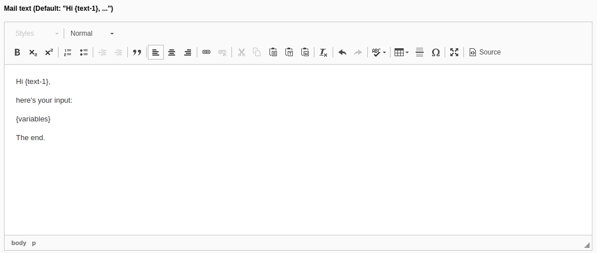

# TYPO3 Extension form\_mailtext

This extension enhances the email finishers of EXT:form by a new field 'Mail text' (`message`) that allows the editor to define the mail text within the form plugin in the backend:



## EmailFinisher override

For this to work the email finisher class of EXT:form is being overridden by our [EmailFinisher](./Classes/Domain/Finishers/EmailFinisher.php), so the `message` variable can be passed through to the template [Finishers/Email/Html.html](./Resources/Private/Frontend/Templates/Finishers/Email/Html.html) where it's being processed by [RenderMessageViewHelper](./Classes/ViewHelpers/RenderMessageViewHelper.php) and rendered to all created emails.

## TypoScript

The following TS setup is added automatically via [ext\_typoscript\_setup.typoscript](./ext_typoscript_setup.typoscript):

```
plugin.tx_form {
    settings {
        yamlConfigurations {
            100 = EXT:form_mailtext/Configuration/Form/MailtextFormSetup.yaml
        }
    }
}
module.tx_form {
    settings {
        yamlConfigurations {
            100 = EXT:form_mailtext/Configuration/Form/MailtextFormSetup.yaml
        }
    }
}
```

## Mail text

Within the mail text you can output any user input using the identifier of the input field, e.g. `{text-1}`.

Additionally there's an **experimental feature** enabling you to use `if` like control flows:

```
Hi {text-1},

you've selected {if:singleselect-1:=:}nothing{endif}{if:singleselect-1:=:1}apple{endif}{if:singleselect-1:=:2}orange{endif}{if:singleselect-1:=:3}banana{endif}.

And your other input is within an array: {if:multiselect-1:in:cat,dog,hamster}it's a pet{endif}

Apparently you like {if:selectsingle-1:=:1}bikes{else}walking{endif}

Good bye.
```
